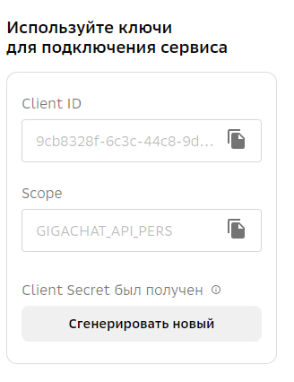

# Получение ключей авторизации

На текщий момент оба отечественных провайдера ИИ (YandexGPT и GigaChat) предоставляют свои продукты бесплатно в рамках программы preview:

- YandexGPT предоставляет 4000р. - при цене 20 копеек за 1000 токенов
- GigaChat предоставляет 1 миллион токенов

В текущей версии продуктов обоих провайдеров используется около 1000 токенов на один запрос. Ведется работа с провайдерами по уменьшению используемого количества токенов для одного запроса.

Регистрация и получение ключей авторизации - абсолютно бесплатная и простая процедура. Рассмотрим процесс для каждого из провайдеров:

1.GigaChat

- регистрируемся на сайте https://developers.sber.ru/portal/products/gigachat-api
- переходим в раздел Мой GigaChat API
- в правой части экрана в блоке "Используйте ключи для подключения сервиса" сгенерируйте ключи и сохраните их в надежное место

  

- для использования в программе вам понадобится содержимое Scope

2. YandexGPT

- регистрируемся на сайте https://yandex.cloud
- переходим в консоль
- создаем каталог сервисов
- переходим в подраздел "Сервисные аккаунты" и генерируем ключь для доступа к YandexGPT (его мы и будем использовать)

ВНИМАНИЕ!

- храните эти ключи в надежном месте
- настройте в системах лимиты и оповещения чтобы следить за потреблением ресурсов
- в случае утери или компроментации ваших ключей - просто удалите их
- ваши ключи в программе используются только лишь для авторизации вас у провайдеров и получения доступа к сервисам генерации текстов при помощи ИИ, нигде не храняться и никому не передаются!
